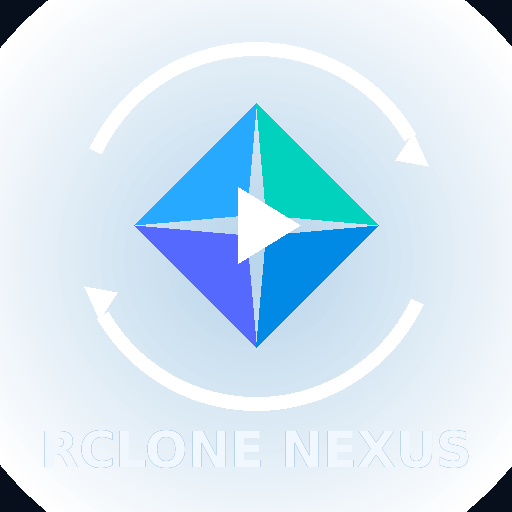

<div align="center">



# 🌌 Rclone Nexus for Kodi Android

**Browse and stream your `rclone` remotes directly in Kodi — no WebDAV, no mounts, no hassle.**

[](https://github.com/warpirobo/rclone-nexus-kodi/releases)
[](LICENSE.txt)
[](#requirements)

[](https://www.paypal.com/paypalme/ITARIOS)

</div>

---

## ✨ What is this?

**Rclone Nexus** is a Kodi video add-on that browses and streams content from `rclone` remotes — including `crypt`, `combine`, `union`, `alias`, and virtually any compatible cloud storage service. It can also generate incremental `.strm` libraries without downloading the media files to the device.

Built to run smoothly on **Amazon Fire Stick, Onn, Google TV**, and any Android TV device — even older, resource-constrained models.

### 🔑 Highlights

| | |
|---|---|
| 📁 | Folder browsing with favorites, search, and new-content detection |
| 📼 | Recursive export to `.strm` files for the Kodi library |
| 🔄 | Incremental synchronization — adds, updates, and removes entries automatically |
| ⏱️ | Optional background synchronization (disabled by default) |
| 🔒 | 100% local rclone binary handling — the add-on **never** downloads it from the internet |
| 💾 | Bounded temporary storage, VFS disk caching disabled by default |

---

## 📋 Requirements

- Kodi 19 (Matrix) or newer, on Android or Fire OS
- A working `rclone.conf` file
- A compatible rclone binary (see section below)
- Access to an already-configured rclone remote

---

## ⚠️ Important: Android 10 or higher

If your device runs **Android 10, 11, 12, 13, or 14**, Android's system policy (W^X) blocks execution of binaries copied to the app's private folders — the add-on won't be able to run rclone and will fail with a permissions error.

**The fix is to use a modified build of Kodi with `targetSdkVersion` lowered to 28 (Android 9)**, which makes the OS treat Kodi under Android 9's permission rules and allows the binary to execute without issue.

### How to patch your Kodi APK

1. Download **[APK Editor Studio](https://qwertycube.com/apk-editor-studio/)** (free, available for Windows/Linux/Mac).
2. Open your Kodi APK (download it from [kodi.tv](https://kodi.tv/download) if you don't have it).
3. In the **Manifest** panel, find **Target SDK** and change it to **28 (9.0 — Pie)**.
4. Save the changes and export the modified APK (**Build → Save**).
5. Install this modified APK on your device instead of the official Kodi build.

> 📌 This step is only necessary on Android 10+. On Fire Stick 4K 1st generation (Android 7) and other devices running Android 9 or lower, the official Kodi build works without modification.

---

## 📦 rclone binary — where to get it

The add-on **does not include or download** the rclone binary itself — you need to add it to the package yourself or point to its path in the settings. This is intentional: it keeps the add-on lightweight and gives you full control over the version you use.

### For Fire Stick, Onn, Google TV, and most Android TV devices (32-bit ARM)

Download the **armv7a** binary from rclone's official test builds:

**➡️ [rclone-android-21-armv7a.gz](https://beta.rclone.org/v1.74.4/testbuilds/rclone-android-21-armv7a.gz)**

This architecture covers the vast majority of Android TV devices on the market, even ones with 64-bit CPUs — Fire OS and many third-party launchers still run in 32-bit compatibility mode.

Other architectures available in the same repository ([see full folder](https://beta.rclone.org/v1.74.4/testbuilds/)):

| Architecture | File | Typical devices |
|---|---|---|
| ARM 32-bit | `rclone-android-21-armv7a.gz` | Fire Stick, Onn, most Android TV |
| ARM 64-bit | `rclone-android-21-armv8a.gz` | Native 64-bit Android TV devices |
| x86 | `rclone-android-21-x86.gz` | Emulators, some Intel-based Android TV |
| x86_64 | `rclone-android-21-x64.gz` | Emulators and x64 devices |

### Where to place it inside the add-on ZIP

```
resources/bin/android/armeabi-v7a/rclone       ← 32-bit ARM (Fire Stick, Onn, etc.)
resources/bin/android/arm64-v8a/rclone         ← 64-bit ARM
resources/bin/android/x86/rclone               ← x86
resources/bin/android/x86_64/rclone            ← x86_64
```

Only bundle the architecture you need to keep the package small. You can also leave the file compressed as `rclone.gz` in that same folder — the add-on unpacks it automatically. Alternatively, configure the **direct path to the rclone binary** in the add-on settings if you'd rather not bundle it.

---

## 🚀 Install from a release ZIP

1. Download `plugin.ariostv-<version>.zip` from the [Releases page](https://github.com/warpirobo/rclone-nexus-kodi/releases).
2. In Kodi, enable **Settings → System → Add-ons → Unknown sources**.
3. Go to **Add-ons → Install from ZIP file** and select the downloaded ZIP.
4. Open the add-on settings and configure your `rclone.conf` and the rclone binary if they aren't auto-detected.

---

## 🎬 Create a Kodi STRM library

1. Open a remote and select a folder.
2. Open its context menu.
3. Select **Export folder to STRM library**.
4. Choose Movies, TV Shows, or General videos.
5. Rclone Nexus creates the `.strm` files, registers the folder as a Kodi video source, and requests a library update.
6. The first time, go to **Videos → Files**, open the context menu on the `Rclone Nexus - ...` source, and select **Set content** to choose the appropriate scraper.

---

## 🔍 Detect new content

- From a folder: context menu → **Check for new content here**.
- From **STRM libraries**: sync one library or all libraries.
- Files added after the initial scan appear under **New content**.
- Automatic synchronization can be enabled in Settings; use an interval of at least 30 minutes.

---

## 💾 Storage policy

Default playback settings:

- `--vfs-cache-mode off`
- 8 MB in-memory buffer
- 16 MB initial read chunks, up to 128 MB

Media files are **not stored** on the device. The add-on also removes leftover VFS cache from versions prior to 1.2.0 and applies hard limits to logs, temporary files, and browsing cache.

---

## 🛠️ Build your own release ZIP

```bash
python scripts/build_release.py
```

The installable file is written to `dist/plugin.ariostv-<version>.zip`.

---

## ☕ Found this useful?

This project is maintained in my spare time. If it helped you and you'd like to buy me a coffee, any support is welcome:

<div align="center">

[](https://www.paypal.com/paypalme/ITARIOS)

</div>

---

## 📄 License and project status

Licensed under **GPL-3.0-or-later**. This project is independent and is not affiliated with the Kodi Foundation or the rclone project.
